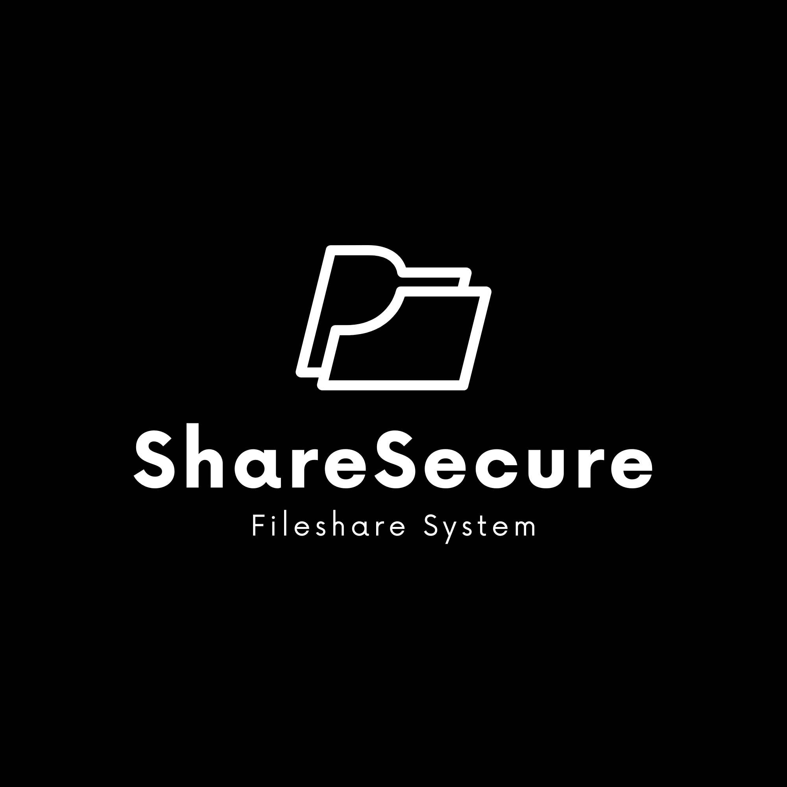

# ShareSecure



A dead-simple way to share files that actually respects your privacy.

Upload a PDF or Word document, get a link, share it. Everyone who opens it gets their own unique link — there's no trail connecting them. When the expiry hits zero, it's gone for good. No accounts to manage, no tracking.

---

## What You Get

**Privacy First**
- Every link is completely unique. Share with Alice, she gets her own link. If she shares it with Bob, Bob gets a different link. There's no chain, no way to trace who got it from who.
- The database is designed so every row looks identical — no timestamps linking reshares, no exact file sizes, no content fingerprints. Even a full DB leak tells an attacker almost nothing.
- No cookies, no user tracking. Anonymous uploads require no account.
- **IP Address Notice:** Your IP address is inherently visible to the server and any network infrastructure between you and the server. ShareSecure does not explicitly log IP addresses in its application code, but the underlying OS, web server, or hosting provider may retain connection logs outside this application's control. If your threat model requires IP anonymity, access this service over **Tor** or a trusted **VPN**.

**It Actually Works**
- Only PDF and DOCX files accepted. File type is verified by magic bytes (actual binary signature), not the filename or user-supplied MIME type — spoofing is not possible.
- Every file is verified with SHA-256. If someone tries to mess with it, you'll know immediately.
- Each person who accesses a file gets their own delete token. You're in control of what you can remove.
- Files automatically expire (1 minute to 24 hours). When time's up, they're gone forever.

**Annotations (PDFs)**
- Mark up PDFs with pen, highlighter, or eraser. Your annotations stay with your link only.
- Save them, don't save them — it's up to you. Browser will warn you if you're about to lose unsaved work.

**Built-In Protection**
- Can't right-click, can't print, can't save. We block Ctrl+S, Ctrl+P, the whole thing.
- No caching, ever. Devices won't keep copies hanging around.

---

## Architecture

```
sharesecure/
├── db/                            # Database schemas (reference only — server auto-creates tables)
│   ├── schema.sql                 # Files table schema
│   └── auth_schema.sql            # Users table schema
├── docs/                          # Documentation
│   ├── SECURITY.md                # Security policy & vulnerability reporting
│   └── TERMS_AND_CONDITIONS.md    # Legal terms (source document)
├── public/                        # Static frontend (served at root)
│   ├── index.html                 # Upload page
│   ├── app.js                     # Upload page logic
│   ├── style.css                  # Upload page styles
│   ├── viewer.html                # File viewer page
│   ├── viewer.js                  # Viewer logic (PDF.js, annotations, sharing)
│   ├── viewer.css                 # Viewer styles
│   ├── terms.html                 # Terms & Conditions page
│   ├── 404.html                   # Not found page
│   ├── expired.html               # Expired file page
│   ├── icon.ico                   # Favicon
│   ├── ShareSecure.png            # Logo / banner
│   └── qrcode.min.js              # Client-side QR generation (no third-party calls)
├── server/                        # Express.js server
│   ├── index.js                   # Main server entry point
│   ├── db.js                      # SQLite database setup & migrations
│   ├── utils.js                   # Encryption, compression, pseudonymous ID utilities
│   └── routes/
│       ├── files.js               # Upload/download/delete/reshare routes
│       └── auth.js                # Authentication routes
├── functions/                     # Cloudflare Pages Functions (serverless API)
│   ├── _middleware.js             # Security headers (applied to ALL responses)
│   └── api/
│       ├── upload.js              # POST  - Upload file
│       ├── info/[shortId].js      # GET   - File metadata
│       ├── raw/[shortId].js       # GET   - Raw file bytes
│       ├── download/[shortId].js  # GET   - Force-download
│       ├── reshare/[shortId].js   # POST  - Untraceable reshare link
│       ├── delete/[shortId].js    # POST  - Delete file
│       ├── annotations/[shortId].js # GET/POST - PDF annotations
│       └── r/[shortId].js         # Viewer route handler
├── .env.example                   # Example environment configuration
├── package.json
└── wrangler.toml                  # Cloudflare Wrangler config
```

---

## How It Actually Works

```
 You                      Friend A                  Friend B
   |                         |                         |
   |  upload document        |                         |
   |  get link: /r/ABC123    |                         |
   |  (keep it)              |                         |
   |                         |                         |
   |  send /r/ABC123 ------> |                         |
   |                         |  they open it           |
   |                         |  get new link: /r/XYZ   |
   |                         |  (completely separate)  |
   |                         |                         |
   |                         |  share /r/XYZ -------> |
   |                         |                         |  they open it
   |                         |                         |  get link: /r/QRS
   |                         |                         |  (totally independent)
   V                         V                         V
  DB Row ABC123            DB Row XYZ                DB Row QRS
  [identical structure]    [identical structure]    [identical structure]

  Even if the database leaks, nobody can figure out
  who shared with who. All the rows look the same.
```

---

## Security

We strip all identifying headers, block caching everywhere, force HTTPS, prevent search engine indexing, and block browser APIs you don't need. No referrer leaks, no fingerprinting, no iframe embedding. File type is validated by magic bytes on every upload. The file is verified against its SHA-256 hash on every single access. If something's wrong, you'll know.

---

## Self-Hosting

Run your own private ShareSecure instance. You own the data, you control the keys.

> **Quick link:** [github.com/ishaanman7898/ShareSecure#self-hosting](https://github.com/ishaanman7898/ShareSecure?tab=readme-ov-file#self-hosting)

### Prerequisites

- **Node.js 18 or later** — [nodejs.org](https://nodejs.org)
- **Git** — [git-scm.com](https://git-scm.com)
- An encryption key (instructions below — no extra tools required)

---

### Step 1 — Clone the Repository

```bash
git clone https://github.com/ishaanman7898/ShareSecure.git
cd ShareSecure
npm install
```

---

### Step 2 — Generate an Encryption Key

The encryption key is a 64-character hex string (32 random bytes). You have several ways to generate one:

#### Option A — Using Node.js (no extra tools needed)
```bash
node -e "console.log('ENCRYPTION_KEY=' + require('crypto').randomBytes(32).toString('hex'))"
```
This works on every platform with Node.js installed. Copy the entire `ENCRYPTION_KEY=...` line.

#### Option B — Using OpenSSL

OpenSSL is a standard cryptography toolkit. It may or may not be pre-installed.

**Check if you have it:**
```bash
openssl version
```

**Install OpenSSL if missing:**

| Platform | Command |
|---|---|
| **Windows** (winget) | `winget install ShiningLight.OpenSSL` |
| **Windows** (Chocolatey) | `choco install openssl` |
| **Windows** (manual) | Download from [slproweb.com/products/Win32OpenSSL.html](https://slproweb.com/products/Win32OpenSSL.html) — grab the "Light" installer |
| **macOS** (Homebrew) | `brew install openssl` |
| **Ubuntu / Debian** | `sudo apt-get install openssl` |
| **Fedora / RHEL / CentOS** | `sudo dnf install openssl` |
| **Arch Linux** | `sudo pacman -S openssl` |
| **Alpine Linux** | `apk add openssl` |

**Generate the key:**
```bash
openssl rand -hex 32
```
Prefix it: `ENCRYPTION_KEY=<output>`

#### Option C — Using npm script
```bash
npm run generate-key
```
This uses Node.js internally — same as Option A but packaged for convenience.

---

### Step 3 — Configure Environment

Copy the example file and fill it in:

```bash
cp .env.example .env
```

Open `.env` in any text editor:

```env
PORT=3000
BASE_URL=http://localhost:3000

# Paste the ENCRYPTION_KEY line from Step 2 here
ENCRYPTION_KEY=your64hexcharskeyhere

# Set to false to disable the localtunnel public URL
USE_LOCAL_TUNNEL=true

# Optional: reserve a stable public subdomain via localtunnel
# TUNNEL_SUBDOMAIN=my-sharesecure

# Optional: custom data directory (default: ./data)
# DATA_DIR=/var/lib/sharesecure
```

> **Keep your `ENCRYPTION_KEY` safe.** If you lose it, all stored files become permanently unreadable.

**First-time shortcut:** If you skip this step, the server will auto-generate `.env` with a random key on first run. Check the console output and back up the generated key.

---

### Step 4 — Run the Server

```bash
npm start
```

The server starts on `http://localhost:3000`.

If `USE_LOCAL_TUNNEL=true`, a public HTTPS URL is printed to the console — share that with anyone on a different device or network.

For development with auto-restart on code changes:
```bash
npm run dev
```

---

### Method 2 — Cloudflare Pages (Serverless)

For a zero-maintenance serverless deployment with Cloudflare's global edge network.

**You'll need:**
- A free [Cloudflare](https://cloudflare.com) account
- A free [Turso](https://turso.tech) database (SQLite hosted on the edge)

**Steps:**

1. Fork this repo to your GitHub account
2. In Cloudflare → Pages → Create project → Connect your fork
3. Set build output directory to `public` (no build command needed)
4. In Pages → Settings → Environment Variables, add:
   - `TURSO_TOKEN` — your Turso database auth token
   - `ENCRYPTION_KEY` — 64 hex chars (from Step 2 above)
   - `BASE_URL` — your Pages URL (e.g. `https://sharesecure.pages.dev`)
5. In your Turso database, run the schema:
   ```bash
   turso db shell YOUR_DB_NAME < db/schema.sql
   ```
6. Deploy

All file data is AES-256-GCM encrypted before it hits the database. Even full DB access reveals nothing without the key.

---

### Method 3 — Reverse Proxy (Production)

For production use behind Nginx or Caddy:

**Nginx example:**
```nginx
server {
    listen 80;
    server_name sharesecure.yourdomain.com;
    return 301 https://$host$request_uri;
}
server {
    listen 443 ssl;
    server_name sharesecure.yourdomain.com;

    ssl_certificate     /etc/letsencrypt/live/sharesecure.yourdomain.com/fullchain.pem;
    ssl_certificate_key /etc/letsencrypt/live/sharesecure.yourdomain.com/privkey.pem;

    location / {
        proxy_pass http://127.0.0.1:3000;
        proxy_set_header Host $host;
        proxy_set_header X-Forwarded-For $proxy_add_x_forwarded_for;
        client_max_body_size 12M;
    }
}
```

**Caddy example (automatic HTTPS):**
```caddyfile
sharesecure.yourdomain.com {
    reverse_proxy localhost:3000
    request_body {
        max_size 12MB
    }
}
```

Set `BASE_URL=https://sharesecure.yourdomain.com` and `USE_LOCAL_TUNNEL=false` in `.env`.

---

### Running as a System Service (Linux)

To keep ShareSecure running after reboot:

```bash
sudo nano /etc/systemd/system/sharesecure.service
```

```ini
[Unit]
Description=ShareSecure
After=network.target

[Service]
Type=simple
User=www-data
WorkingDirectory=/opt/sharesecure
ExecStart=/usr/bin/node server/index.js
Restart=on-failure
Environment=NODE_ENV=production

[Install]
WantedBy=multi-user.target
```

```bash
sudo systemctl daemon-reload
sudo systemctl enable sharesecure
sudo systemctl start sharesecure
sudo systemctl status sharesecure
```

---

### Configuration Reference

| Variable | Default | Description |
|---|---|---|
| `PORT` | `3000` | HTTP port to listen on |
| `BASE_URL` | `http://localhost:3000` | Public-facing base URL for generated links |
| `ENCRYPTION_KEY` | *(none)* | 64 hex chars — AES-256-GCM key. Auto-generated if blank. |
| `USE_LOCAL_TUNNEL` | `true` | Set `false` to disable localtunnel |
| `TUNNEL_SUBDOMAIN` | *(random)* | Optional fixed subdomain for localtunnel |
| `DATA_DIR` | `./data` | Directory for SQLite DB and uploaded files |
| `DB_PATH` | `<DATA_DIR>/sharesecure.db` | Override database path |

---

### Troubleshooting

**"ENCRYPTION_KEY not set" warning**
Files will be stored unencrypted on disk. Generate a key with `npm run generate-key` and add it to `.env`.

**Port already in use**
Set a different port: `PORT=3001` in `.env`.

**localtunnel not starting**
Set `USE_LOCAL_TUNNEL=false` in `.env`. Use a reverse proxy for production.

**"Cannot find module" on startup**
Run `npm install` in the project directory.

**Files not persisting after Docker restart**
Ensure the volume mount is correct: `-v $(pwd)/data:/app/data`.

---

## API Reference

### `POST /api/upload`
Upload a file and receive a unique link. Only PDF and DOCX accepted; file type is verified by magic bytes server-side.

**Request**: `multipart/form-data`
- `file` — The file to upload (max 10 MB, PDF or DOCX only)
- `expires_hours` — Expiry time in hours (min: 1 min, max: 24 h)
- `allow_annotations` — `1` to enable PDF annotations
- `allow_download` — `1` to enable download button

**Response**:
```json
{
  "shortId": "ABC12345",
  "shortUrl": "https://example.com/r/ABC12345",
  "filename": "document.pdf",
  "size": 245760,
  "expiresAt": "2024-01-01T13:00:00.000Z",
  "deleteToken": "x9Kp2mQ7..."
}
```

### `GET /api/info/:shortId`
Get file metadata (no file content).

### `GET /api/raw/:shortId`
Get raw file bytes for rendering. Verifies SHA-256 integrity before serving. Returns `application/octet-stream` (privacy — no MIME in headers).

### `POST /api/reshare/:shortId`
Generate a new untraceable link pointing to the same file content.

### `POST /api/delete/:shortId`
Delete a file. Requires `{ deleteToken: "..." }` in the request body. Triggers cascade deletion of the entire cluster.

### `GET /api/annotations/:shortId` / `POST /api/annotations/:shortId`
Load or save PDF annotation strokes for a specific link. Annotations are encrypted and isolated per-link.

---

## What If...

**Someone hacks the database?**
Every row is identical. They won't know who uploaded, who viewed, or who reshared.

**They modify a file?**
SHA-256 verification catches it. The viewer shows you a tamper alert.

**They try to trace who shared with who?**
Can't. Each share generates a new, independent link.

**They sniff your traffic?**
HTTPS encrypts the content. There's no referrer data or identifying headers in ShareSecure's responses. Your IP address is visible at the network layer — use Tor or a VPN if that matters for you.

**They upload a malicious file?**
Magic byte validation rejects anything that isn't actually a PDF or DOCX. The file type is determined from the binary content, not the filename or MIME header.

**Your browser caches it?**
Nope. We tell it not to.

---

## Known Limitations & Planned Improvements

We are transparent about the current limitations so users can make informed decisions. This section describes the gaps honestly — but deliberately avoids technical specifics that could assist exploitation. If you discover a security issue, please report it privately via the [security policy](docs/SECURITY.md) rather than publicly.

---

### Authentication and Session Privacy

**Current state:** The optional login system lets users see their own active uploads in a dashboard and enforces a per-session upload rate limit. To make this work, uploads are associated with a pseudonymous identifier derived from the user's session — not a raw username or user ID. A database leak alone cannot link an upload to an account without also having the server's encryption key.

**Limitation:** If an attacker has both the database *and* the encryption key, session-to-upload linkage becomes possible. The login system is optional — anonymous uploading has no such linkage at all.

**Planned:** Move the dashboard entirely client-side (localStorage), eliminating any server-side session-to-upload association entirely.

---

### IP Address Visibility

**Current state:** The application itself does not log, store, or process IP addresses. Forwarding headers are stripped before they reach route handlers. However, the OS, web server, localtunnel service, or hosting provider may log connection-level data that includes IPs outside the application's control.

**Limitation:** Application-layer IP stripping cannot prevent network infrastructure from retaining connection records.

**Planned:** Ship an official Cloudflare Workers deployment path where Cloudflare's IP anonymization hides visitor IPs at the edge before the request ever reaches application code.

---

### Encryption Key Management

**Current state:** A single encryption key protects all stored file data at rest. The key lives in `.env` alongside the application.

**Limitation:** The key and the database should be stored separately. Keeping both on the same host reduces the security benefit of encryption at rest.

**Planned:** Document integration with external secrets managers (e.g., environment injection via CI/CD, cloud KMS) so the key never touches the same disk as the data.

---

### DOCX Container Validation

**Current state:** DOCX files are validated by their ZIP magic bytes. DOCX is an Open XML format stored as a ZIP archive, so any valid ZIP passes the magic byte check.

**Limitation:** A crafted file that is a valid ZIP but not a genuine Word document could pass this check.

**Planned:** Add inspection of the internal ZIP manifest to confirm the presence of expected Word document structure before accepting the file.

---

### Forward Secrecy for Stored Files

**Current state:** All files are encrypted with the same long-lived AES-256-GCM key.

**Limitation:** Compromise of the key retroactively exposes all files that were stored with it, not just future ones.

**Planned:** Implement per-file ephemeral key wrapping so that each file is encrypted with a unique key, with only the wrapped key material stored — providing cryptographic isolation between files.

---

## Docs

- [Terms & Conditions](/terms) — Legal disclaimer and usage policy
- [Security Policy](docs/SECURITY.md) — Vulnerability reporting
- [Database Schema](db/schema.sql) — Files table
- [Auth Schema](db/auth_schema.sql) — Users table

---

## License

MIT
