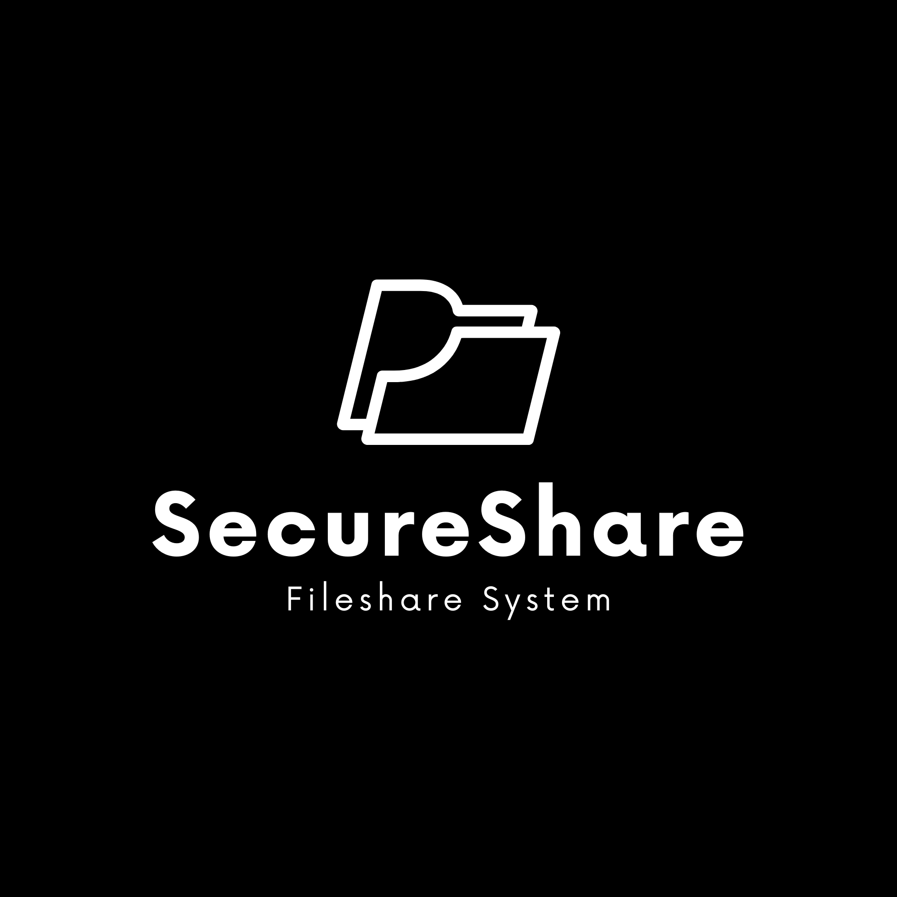

# ShareSecure



A dead-simple way to share files that actually respects your privacy.

Upload a file, get a link, share it. Everyone who opens it gets their own unique link — there's no trail connecting them. When the expiry hits zero, it's gone for good. No accounts to manage, no tracking, no bullshit.

---

## What You Get

**Privacy First**
- Every link is completely unique. Share with Alice, she gets her own link. If she shares it with Bob, Bob gets a different link. There's no chain, no way to trace who got it from who.
- The database is basically useless to hackers — every row looks identical. They can't tell who uploaded, who viewed, or who reshared.
- No IP logging, no cookies, no user accounts. Your activity is invisible.

**It Actually Works**
- Every file is verified with SHA-256. If someone tries to mess with it, you'll know immediately.
- Each person who accesses a file gets their own delete token. You're in control of what you can remove.
- Files automatically expire (1 minute to 24 hours). When time's up, they're gone forever.

**Annotations (PDFs)**
- Mark up PDFs with pen, highlighter, or eraser. Your annotations stay with your link only.
- Save them, don't save them — it's up to you. Browser will warn you if you're about to lose unsaved work.

**Built-In Protection**
- Can't right-click, can't print, can't save. We block Ctrl+S, Ctrl+P, the whole thing.
- No caching, ever. Devices won't keep copies hanging around.

---

## Architecture

```
fileshare/
├── functions/                 # Cloudflare Pages Functions (serverless API)
│   ├── _middleware.js         # Security headers (applied to ALL responses)
│   ├── api/
│   │   ├── upload.js          # POST  - Upload file, returns shortId + deleteToken
│   │   ├── info/[shortId].js  # GET   - File metadata + integrity hash
│   │   ├── raw/[shortId].js   # GET   - Raw file bytes (integrity-verified)
│   │   ├── download/[shortId].js  # GET - Force-download (integrity-verified)
│   │   ├── reshare/[shortId].js   # POST - Generate untraceable reshare link
│   │   ├── delete/[shortId].js    # POST - Delete file (requires delete token)
│   │   └── annotations/[shortId].js # GET/POST - Load/save PDF annotations
│   └── r/[shortId].js        # Viewer route handler
├── public/                    # Static frontend
│   ├── index.html             # Upload page
│   ├── app.js                 # Upload page logic
│   ├── style.css              # Upload page styles
│   ├── viewer.html            # File viewer page
│   ├── viewer.js              # Viewer logic (PDF.js, annotations, sharing)
│   ├── viewer.css             # Viewer styles
│   ├── 404.html               # Not found page
│   ├── expired.html           # Expired file page
│   └── qrcode.min.js          # Client-side QR generation (no third-party calls)
├── schema.sql                 # Database schema
├── wrangler.toml              # Cloudflare configuration
└── package.json
```

---

## Database Schema

```sql
CREATE TABLE IF NOT EXISTS files (
  id INTEGER PRIMARY KEY AUTOINCREMENT,
  short_id TEXT UNIQUE NOT NULL,       -- 8-char random link ID
  original_filename TEXT NOT NULL,      -- Display name only
  mime_type TEXT NOT NULL,
  size_bytes INTEGER NOT NULL,
  file_data TEXT NOT NULL,             -- Base64-encoded file (EVERY row has this)
  uploaded_at DATETIME DEFAULT CURRENT_TIMESTAMP,
  expires_at DATETIME,                 -- Mandatory expiry
  download_count INTEGER DEFAULT 0,
  is_active INTEGER DEFAULT 1,
  source_short_id TEXT,                -- Always NULL (kept for schema compat)
  is_used INTEGER DEFAULT 0,
  delete_token TEXT,                   -- 24-char random auth token (EVERY row has this)
  integrity_hash TEXT NOT NULL,        -- SHA-256 of raw file bytes
  annotations TEXT DEFAULT '[]',       -- JSON array of annotation strokes
  cluster_id TEXT,                     -- Zero-Knowledge grouping hash
  parent_short_id TEXT                 -- Hierarchical deletion link
);
```

---

## Security (The Boring But Important Stuff)

We strip all identifying headers, block caching everywhere, force HTTPS, prevent search engine indexing, and block browser APIs you don't need. No referrer leaks, no fingerprinting, no iframe embedding. The file is verified on every single access. If something's wrong, you'll know.

---

## How It Actually Works

```
 You                      Friend A                  Friend B
   |                         |                         |
   |  upload document        |                         |
   |  get link: /r/ABC123    |                         |
   |  (keep it)              |                         |
   |                         |                         |
   |  send /r/ABC123 ------> |                         |
   |                         |  they open it           |
   |                         |  get new link: /r/XYZ   |
   |                         |  (completely separate)  |
   |                         |                         |
   |                         |  share /r/XYZ -------> |
   |                         |                         |  they open it
   |                         |                         |  get link: /r/QRS
   |                         |                         |  (totally independent)
   |                         |                         |
   V                         V                         V
  DB Row ABC123            DB Row XYZ                DB Row QRS
  [identical structure]    [identical structure]    [identical structure]

  Even if the database leaks, nobody can figure out
  who shared with who. All the rows look the same.
```

---

## Free Database Alternatives

The app currently uses a distributed **Turso** cluster (LibSQL). Here are other free-forever options that work as alternatives:

- **Cloudflare D1** (SQLite on the edge)
- **Turso** (Distributed SQLite replicas)
- **PlanetScale** (MySQL-compatible serverless)
- **Supabase** (PostgreSQL-as-a-service)
- **Neon** (Serverless PostgreSQL)
- **CockroachDB Serverless** (Distributed SQL)

---

## Deployment

### Cloudflare Pages (via GitHub)

1. Push this repo to GitHub
2. Go to Cloudflare Pages → Create a project → Connect your GitHub repo
3. Build settings: no build command needed, output directory is `public`
4. Set these secrets in Cloudflare Pages → Settings → Environment Variables:
   - `TURSO_TOKEN` — your Turso auth token
   - `ENCRYPTION_KEY` — 64 hex chars (32 random bytes). Generate with: `openssl rand -hex 32`
   - `BASE_URL` — your Pages URL (e.g. `https://sharesecure.pages.dev`)
5. Deploy

> **Important:** Keep your `ENCRYPTION_KEY` backed up somewhere safe. If you lose it, all stored files become unreadable.

---

## Self-Hosting

Want to run your own private instance? The whole app is a Cloudflare Pages project — no servers, no Docker, no infrastructure to manage.

### What you need
- A [Cloudflare](https://cloudflare.com) account (free)
- A [Turso](https://turso.tech) database (free tier works)
- That's it

### Steps
1. Fork this repo to your GitHub
2. Create a new Cloudflare Pages project → connect your fork
3. Set build output directory to `public`
4. Add these environment secrets in Pages → Settings → Environment Variables:
   - `TURSO_TOKEN` — your Turso database auth token
   - `ENCRYPTION_KEY` — 64 hex chars: `openssl rand -hex 32`
   - `BASE_URL` — your Pages URL
5. Run `schema.sql` on your Turso database to create the tables
6. Deploy

All file data is AES-256-GCM encrypted before it hits your database. Even if someone gets DB access, they can't read the files without the key.

---

## API Reference

### `POST /api/upload`
Upload a file and receive a unique link.

**Request**: `multipart/form-data`
- `file` -- The file to upload (max 10MB)
- `expires_hours` -- Expiry time in hours (min: 1min, max: 24h)

**Response**:
```json
{
  "shortId": "ABC12345",
  "shortUrl": "https://example.com/r/ABC12345",
  "filename": "document.pdf",
  "size": 245760,
  "expiresAt": "2024-01-01T13:00:00.000Z",
  "deleteToken": "x9Kp2mQ7...",
  "integrityHash": "a1b2c3d4e5f6..."
}
```

### `GET /api/info/:shortId`
Get file metadata (no file content).

### `GET /api/raw/:shortId`
Get raw file bytes for rendering. Verifies SHA-256 integrity before serving.

### `POST /api/reshare/:shortId`
Generate a new untraceable link pointing to the same file content.

### `POST /api/delete/:shortId`
Delete a file (requires the delete token). Root deletion triggers global wipe.

---

## What If...

**Someone hacks the database?**
Every row is identical. They won't know who uploaded, who viewed, or who reshared.

**They modify a file?**
SHA-256 verification catches it. The viewer shows you a tamper alert.

**They try to trace who shared with who?**
Can't. Each share generates a new, independent link.

**They sniff your traffic?**
You're on HTTPS. Even if they see the request, there's no referrer data or identifying headers.

**Your browser caches it?**
Nope. We tell it not to.

---

## License

MIT
