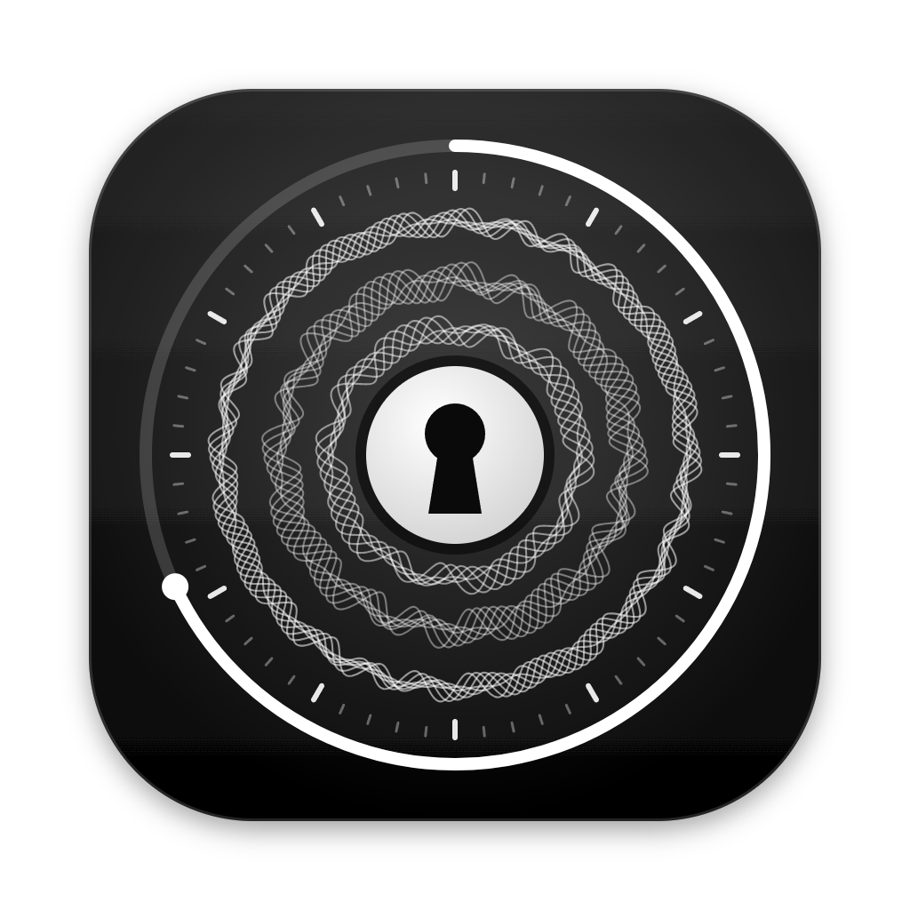

<p align="center"></p>

<h1 align="center">ShareSecure</h1>

<p align="center">Share a file through a private link that stops working when you say.</p>

<p align="center">
  <a href="https://sharesecure-du8.pages.dev">Website</a> ·
  <a href="https://github.com/ishaanman7898/ShareSecure/releases/latest">Desktop app</a> ·
  <a href="https://sharesecure-du8.pages.dev/self-host">Self-hosting</a> ·
  <a href="https://sharesecure-du8.pages.dev/changelog">Changelog</a>
</p>

---

Upload a PDF, Word document or image, choose how long the link lasts (1 hour to 10 days), and send it. Files are encrypted at rest, pages are never indexed, and when the link expires the file is erased.

## Ways to use it

| | Where your files live | Links work | Limits |
|---|---|---|---|
| **[Website](https://sharesecure-du8.pages.dev)** | ShareSecure's servers (Cloudflare + Turso), encrypted | Any time until they expire | 5 uploads a day, 10 MB each |
| **[Desktop app](https://github.com/ishaanman7898/ShareSecure/releases/latest)**: sign in | Same as the website | Any time until they expire | Same as the website |
| **[Desktop app](https://github.com/ishaanman7898/ShareSecure/releases/latest)**: this computer | Only your computer | While the app is running | 10 MB each, no daily limit |
| **[Self-hosted](#self-hosting)** (command line or Docker) | Only your machine or server | While the server is running | 10 MB each, no daily limit |

The desktop app asks which one you want the first time it opens. You can switch later from its tray icon. The installers aren't code-signed yet: on Windows choose **More info → Run anyway**, and on a Mac open the app once, then go to **System Settings → Privacy & Security** and choose **Open Anyway**.

## Features

- **Links that expire** after 1 hour to 10 days, or at a date and time you pick. Expired files are erased.
- **View-only by default.** Choose per file whether people can download it or draw on it.
- **Send to a username.** Files sent to you arrive as requests you accept or decline, and the sender isn't recorded.
- **Unlinked uploads.** In the browser you signed up in, uploads use a zero-knowledge proof instead of your sign-in, and the stored file has no link to your account. The server can still tell which account is uploading while it checks the proof ([how it works](docs/ZK-INTEGRATION.md)).
- **AI assistants.** Claude Code, Codex and other MCP clients can share files for you. [See below.](#ai-assistants-mcp)
- **Your account, your call.** Delete your account and every file shared from it at any time from the account menu.
- **No tracking.** No analytics, ads or cookies.

## AI assistants (MCP)

ShareSecure runs an [MCP](https://modelcontextprotocol.io) server, so an assistant can share a file and hand you the link. Ask it something like “share `report.pdf` for 2 days, view only”.

1. Open the account menu and choose **Connect an AI assistant**, then **Create a connection token**.
2. Add the server to your assistant. The dialog shows these commands with your token filled in.

**Claude Code**

```bash
claude mcp add --transport http sharesecure https://sharesecure-du8.pages.dev/mcp \
  --header "Authorization: Bearer ss_your_token"
```

**Codex**: add this to `~/.codex/config.toml` and set `SHARESECURE_TOKEN` to your token.

```toml
[mcp_servers.sharesecure]
url = "https://sharesecure-du8.pages.dev/mcp"
bearer_token_env_var = "SHARESECURE_TOKEN"
```

In the desktop app's “this computer” mode and on self-hosted installs, the address is `http://localhost:3000/mcp` (the dialog shows the right one).

| Tool | What it does |
|---|---|
| `share_file` | Shares a file by its path. It takes `path`, plus optional `expires_hours` (1–240, default 24), `allow_download`, `name` and `send_to` (a list of usernames, website only). On the website it returns a one-time `curl` upload command that the assistant runs, and the output contains the link. Locally it reads the file directly. |
| `list_shares` | Lists live shares with their links and time left. |
| `delete_share` | Deletes a share so its link stops working. |

Replacing the token cuts off the old one, and **Turn off** disconnects every assistant. Shares made by an assistant count toward the daily limit and appear in *Your shares*.

## How files are protected

- Files, their names and notes are encrypted with AES-256-GCM.
  - **Website:** each file's key is derived from a server master key.
  - **Self-hosted:** each file gets a random key, wrapped by the master key and stored only in the file's database row. Deleting the row (with SQLite `secure_delete`) destroys the key, and the stored file is overwritten and removed.
- File types are checked from the file's contents, not its name. The self-hosted server also strips author and editing metadata from PDF and DOCX files.
- Pages are sent with `noindex`, `no-store` and `frame-ancestors 'none'`.

Encryption isn't end-to-end: whoever holds the master key can decrypt files while they exist. For sensitive files, self-host so the key stays on your machine. Anyone with a link can open the file until it expires. See [SECURITY.md](docs/SECURITY.md), the [privacy policy](https://sharesecure-du8.pages.dev/privacy) and the [terms](https://sharesecure-du8.pages.dev/terms).

## Self-hosting

**macOS / Linux**

```bash
curl -fsSL https://sharesecure-du8.pages.dev/install.sh | bash
```

**Windows (PowerShell)**

```powershell
irm https://sharesecure-du8.pages.dev/install.ps1 | iex
```

**Docker**

```bash
docker run -d --name sharesecure --restart unless-stopped -p 3000:3000 \
  -v sharesecure-data:/app/data $(docker build -q https://github.com/ishaanman7898/ShareSecure.git)
```

The installers set up Node.js if needed and start ShareSecure at `http://localhost:3000`. The first time you open it, you create the owner account. Only the owner can upload; people you share with don't need an account.

- **Data** lives in your app-data folder, not the install folder:
  - Windows: `%LOCALAPPDATA%\ShareSecure`
  - macOS: `~/Library/Application Support/ShareSecure`
  - Linux: `~/.local/share/sharesecure`
- **Updates** install from the app's Updates panel, or automatically if you turn that on. Docker updates by rebuilding.
- **Public links:** a free relay (localtunnel) gives other devices a way in. The relay can see traffic passing through it. If you have your own domain, set `USE_LOCAL_TUNNEL=false` and `BASE_URL`.

| Setting (`.env`) | Default | What it does |
|---|---|---|
| `PORT` | `3000` | Port the server listens on. |
| `BASE_URL` | localhost or the tunnel | Address used in share links. |
| `USE_LOCAL_TUNNEL` | `true` | Create a public link through localtunnel. |
| `ENCRYPTION_KEY` | generated | Encrypts every file. Changing it makes existing files unreadable. |
| `DATA_DIR` | app-data folder | Where the database and encrypted files are stored. |

To install by hand: `git clone https://github.com/ishaanman7898/ShareSecure.git`, then `npm install --omit=dev` and `npm start` (Node.js 20+).

## Development

```bash
npm install
npm start           # self-hosted server at http://localhost:3000
npm run desktop     # the desktop app (rebuilds the SQLite driver for Electron, then back)
npm run dist        # desktop installer for this platform, in dist/
npm run icons       # re-render the app icons from desktop/logo.js
```

Releases are `vX.Y.Z` tags. Pushing one builds the Windows, macOS and Linux installers in GitHub Actions and attaches them to the release. Self-hosted installs and the desktop app update from the latest release. Signing the macOS build is described in [docs/SIGNING.md](docs/SIGNING.md).

```
public/       website and app UI (served by both backends)
functions/    Cloudflare Pages Functions: the website's API, including /mcp
server/       Express server for the desktop app and self-hosted installs
desktop/      Electron app, icons and the first-run welcome screen
docs/         security, zero-knowledge uploads, signing
```

## License

[MIT](LICENSE)
