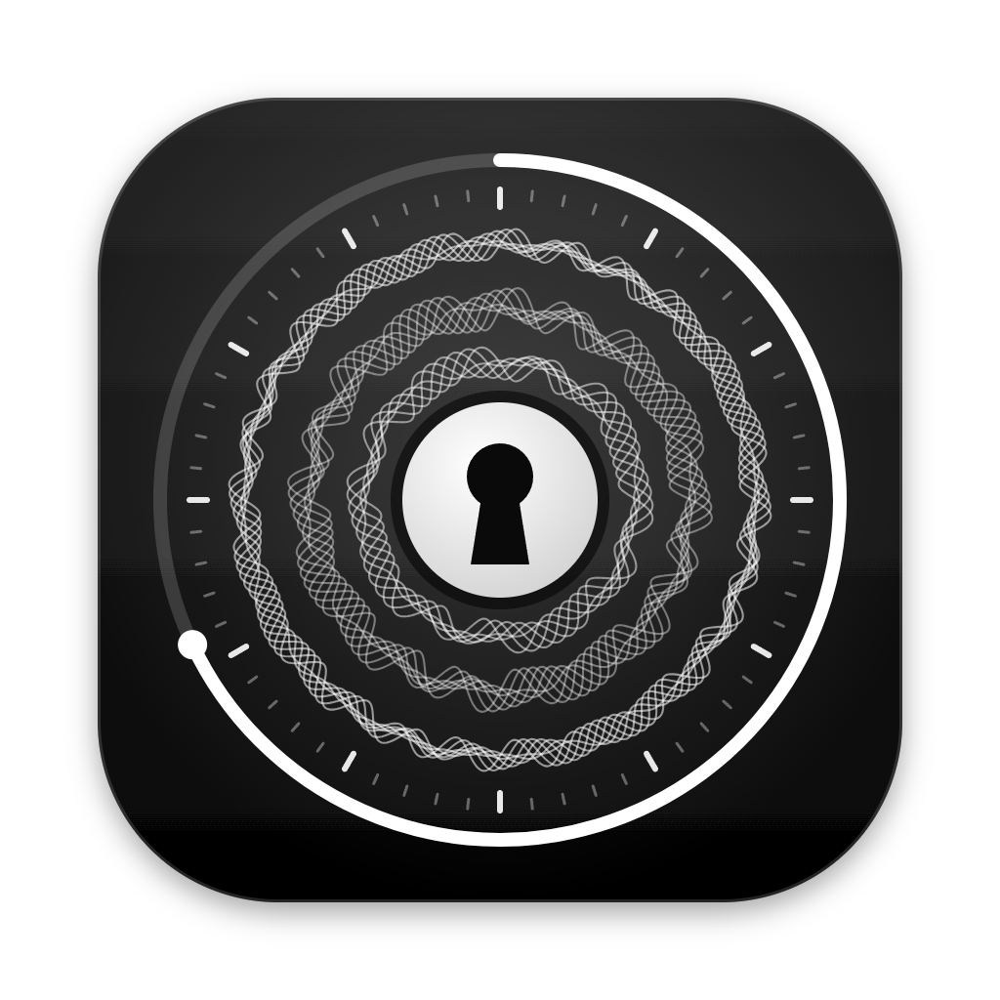

<p align="center"></p>

<h1 align="center">ShareSecure</h1>

<p align="center">Share a file through a private link that stops working when you say.</p>

<p align="center">
  <a href="https://sharesecure-du8.pages.dev">Website</a> ·
  <a href="https://github.com/ishaanman7898/ShareSecure/releases/latest">Desktop app</a> ·
  <a href="https://sharesecure-du8.pages.dev/self-host">Self-hosting</a> ·
  <a href="https://sharesecure-du8.pages.dev/changelog">Changelog</a>
</p>

---

Upload a PDF, Word document, image or text file, choose how long the link lasts (1 hour to 10 days), and send it to someone's username, or share the link or its QR code. Files are encrypted at rest, pages are never indexed, and when the link expires the file is erased.

## Ways to use it

| | Where your files live | Links work | Limits |
|---|---|---|---|
| **[Website](https://sharesecure-du8.pages.dev)** | ShareSecure's servers (Cloudflare + Turso), encrypted | Any time until they expire | 5 uploads a day, 10 MB each |
| **[Desktop app](https://github.com/ishaanman7898/ShareSecure/releases/latest)**: sign in | Same as the website | Any time until they expire | Same as the website |
| **[Desktop app](https://github.com/ishaanman7898/ShareSecure/releases/latest)**: this computer | Only your computer | While the app is running | 10 MB each, no daily limit |
| **[Self-hosted](#self-hosting)** (command line or Docker) | Only your machine or server | While the server is running | 10 MB each, no daily limit |

The desktop app asks which one you want the first time it opens. You can switch later from its tray icon. The installers aren't code-signed yet: on Windows choose **More info → Run anyway**, and on a Mac open the app once, then go to **System Settings → Privacy & Security** and choose **Open Anyway**.

## Features

- **End-to-end encrypted.** On the website, files are locked in your browser before they're uploaded, and the key lives only in the link. ShareSecure can't read them. Add a passcode and the link alone isn't enough.
- **Private by design.** Your password never leaves your browser, uploads and sends can't be tied to your account, and file sizes are padded. [How.](docs/SECURITY.md)
- **Links that expire** after 1 hour to 10 days, or at a date and time you pick. Expired files are erased.
- **View-only by default.** Choose per file whether people can download it or draw on it, and whether only people signed in to ShareSecure can open it.
- **Links branch.** People can reshare a link they were given. Deleting a link removes it and everything shared onward from it; deleting the original removes every link.
- **Send to a username.** Type `@names` when you share, or send an existing share later from *Your shares*. Files sent to you arrive as requests you accept or decline, and they don't show who sent them. In the desktop app's “this computer” mode, link your ShareSecure account first (account menu → **ShareSecure account**); sending then uploads an encrypted copy to ShareSecure's servers, so people can get it while your computer is off.
- **Text files too.** PDF, DOCX, PNG, JPG, TXT, Markdown and CSV, up to 10 MB.
- **AI assistants.** Claude Code, Codex and other MCP clients can share files for you. [See below.](#ai-assistants-mcp)
- **Your account, your call.** Delete your account and every file shared from it at any time from the account menu.
- **No tracking.** No analytics, ads or cookies.

## AI assistants (MCP)

ShareSecure runs an [MCP](https://modelcontextprotocol.io) server, so an assistant can share a file and hand you the link. Ask it something like “share `report.pdf` for 2 days, view only”.

1. Open the account menu and choose **Connect an AI assistant**, then **Create a connection token**.
2. Add the server to your assistant. The dialog shows these commands with your token filled in.

**Claude Code**

```bash
claude mcp add --transport http sharesecure https://sharesecure-du8.pages.dev/mcp \
  --header "Authorization: Bearer ss_your_token"
```

**Codex**: add this to `~/.codex/config.toml` and set `SHARESECURE_TOKEN` to your token.

```toml
[mcp_servers.sharesecure]
url = "https://sharesecure-du8.pages.dev/mcp"
bearer_token_env_var = "SHARESECURE_TOKEN"
```

**Claude app** (web and desktop): open **Settings → Connectors → Add custom connector**.

1. Name it ShareSecure and paste your connector URL, `https://sharesecure-du8.pages.dev/connect/<your token>`.
2. Under **Authentication**, choose **No sign-in**, and leave **Request headers** empty. The token is already in the URL, which is also why the URL must stay private.
3. Leave **Advanced → Transport** on **Streamable HTTP**, add it, and turn ShareSecure on in a chat's tools menu.

**ChatGPT**: open **Plugins → Add → Create new plugin**.

1. **Icon**: upload [`plugin-icon.png`](https://sharesecure-du8.pages.dev/plugin-icon.png) (256 × 256, under 10 KB).
2. **Name**: ShareSecure. **Description**: Share files and text through private links that expire.
3. **Connection**: your connector URL, the same one as for the Claude app.
4. **Authentication**: **No authentication**, not OAuth (the token is in the URL). Tick **I understand and want to continue** and create it.
5. In **Settings → Personalization → Custom instructions**, paste the instructions from the **Connect an AI assistant** dialog, so ChatGPT shares things itself instead of asking you to.

The older custom-GPT actions (`/openapi.json`) still work for plans that have them.

Assistant shares are end-to-end encrypted by default: the link's key (after `#`) isn't kept by ShareSecure, so the assistant gives you the whole link, and passes it to `send_share` to send it on later. Tool results also come back as structured data (`structuredContent`) for clients that read it.

Assistants share text they wrote with `share_text`, and pass files in the call (`content_base64`) or as a link (`source_url`), so the Claude and ChatGPT apps can finish the job themselves. Only when an assistant can't get at the file does `share_file` give you a one-time upload page to pick it.

In the desktop app's “this computer” mode and on self-hosted installs, the address is `http://localhost:3000/mcp` (the dialog shows the right one). The Claude app connector works there too through the public link.

| Tool | What it does |
|---|---|
| `share_file` | Shares a file, end-to-end encrypted unless `private: false`. Give it `path` (the assistant runs on the same computer), `content_base64` with `filename` (a small file the assistant has), or `source_url` (a public https link). Optional: `expires_hours` (1–240, default 24), `allow_download`, `require_account` (website only), `name`, `send_to` (usernames to deliver it to) and `note` (shown to them). On the website, `ask_user` is a last resort that gives you an upload page. |
| `share_text` | Shares text the assistant wrote as a document, with the same options. |
| `begin_upload`, `upload_chunk`, `finish_upload` | Upload a bigger file (up to 10 MB) in pieces, for assistants that can base64 it in code. |
| `upload_status` | Website only: checks an `ask_user` upload page and returns the link once you've picked the file. |
| `send_share` | Sends an existing share to usernames, with an optional `note`. Pass the whole `link` for a private share. |
| `list_shares` | Lists live shares with their links and time left. |
| `delete_share` | Deletes a share so its link stops working. |

Replacing the token cuts off the old one, and **Turn off** disconnects every assistant. Shares made by an assistant count toward the daily limit and appear in *Your shares*. In “this computer” mode, `send_to` and `send_share` need a linked ShareSecure account.

## How files are protected

- **Website, end to end (the default):** the file, its name and type, notes and drawings are encrypted in your browser with AES-256-GCM, using a key that only exists in the link after `#`, and padded to a standard size. An optional passcode makes the link only half the key. Files sent to a username have that key sealed to the recipient's public key (ECDH P-256), so only their browser can open it.
- **Sign-in** never sends your password (based on OPAQUE, RFC 9807), and your private key is locked with a key only your browser gets from signing in.
- **Anonymous uploads and sends:** your browser spends blind-signed tokens (RFC 9474) instead of your sign-in, so the server can enforce daily limits without knowing who uploaded or sent a file.
- **Security codes** let you check nobody swapped someone's key, and your browser warns you if a contact's key ever changes.
- **No third-party code:** pdf.js and mammoth are served from the site, and the desktop app runs the site's code from its own copy.
- Otherwise, files, their names and notes are encrypted on the server with AES-256-GCM.
  - **Website (end to end off):** each file's key is derived from a server master key.
  - **Self-hosted:** each file gets a random key, wrapped by the master key and stored only in the file's database row. Deleting the row (with SQLite `secure_delete`) destroys the key, and the stored file is overwritten and removed.
- File types are checked from the file's contents, not its name. The self-hosted server also strips author and editing metadata from PDF and DOCX files.
- Pages are sent with `noindex`, `no-store` and `frame-ancestors 'none'`.

Files shared with end-to-end encryption off can be read by whoever holds the master key while they exist. Anyone with the whole link (and passcode) can open a file until it expires. See [SECURITY.md](docs/SECURITY.md), the [privacy policy](https://sharesecure-du8.pages.dev/privacy) and the [terms](https://sharesecure-du8.pages.dev/terms).

## Self-hosting

**macOS / Linux**

```bash
curl -fsSL https://sharesecure-du8.pages.dev/install.sh | bash
```

**Windows (PowerShell)**

```powershell
irm https://sharesecure-du8.pages.dev/install.ps1 | iex
```

**Docker**

```bash
docker run -d --name sharesecure --restart unless-stopped -p 3000:3000 \
  -v sharesecure-data:/app/data $(docker build -q https://github.com/ishaanman7898/ShareSecure.git)
```

The installers set up Node.js if needed and start ShareSecure at `http://localhost:3000`. The first time you open it, you create the owner account. Only the owner can upload; people you share with don't need an account.

- **Data** lives in your app-data folder, not the install folder:
  - Windows: `%LOCALAPPDATA%\ShareSecure`
  - macOS: `~/Library/Application Support/ShareSecure`
  - Linux: `~/.local/share/sharesecure`
- **Updates** install from the app's Updates panel, or automatically if you turn that on. Docker updates by rebuilding.
- **Public links:** a free relay (localtunnel) gives other devices a way in. The relay can see traffic passing through it. If you have your own domain, set `USE_LOCAL_TUNNEL=false` and `BASE_URL`.

| Setting (`.env`) | Default | What it does |
|---|---|---|
| `PORT` | `3000` | Port the server listens on. |
| `BASE_URL` | localhost or the tunnel | Address used in share links. |
| `USE_LOCAL_TUNNEL` | `true` | Create a public link through localtunnel. |
| `ENCRYPTION_KEY` | generated | Encrypts every file. Changing it makes existing files unreadable. |
| `DATA_DIR` | app-data folder | Where the database and encrypted files are stored. |

To install by hand: `git clone https://github.com/ishaanman7898/ShareSecure.git`, then `npm install --omit=dev` and `npm start` (Node.js 20+).

## Development

```bash
npm install
npm start           # self-hosted server at http://localhost:3000
npm run desktop     # the desktop app (rebuilds the SQLite driver for Electron, then back)
npm run dist        # desktop installer for this platform, in dist/
npm test            # security tests, including attempts to break in
npm run icons       # re-render the app icons from desktop/logo.js
npm run rosette     # re-draw the rosette logo from desktop/rosette.js
```

Releases are `vX.Y.Z` tags. Pushing one builds the Windows, macOS and Linux installers in GitHub Actions and attaches them to the release. Self-hosted installs and the desktop app update from the latest release. Signing the macOS build is described in [docs/SIGNING.md](docs/SIGNING.md).

```
public/       website and app UI (served by both backends), including the
              encryption, sign-in and token code that runs in the browser
functions/    Cloudflare Pages Functions: the website's API, including /mcp
server/       Express server for the desktop app and self-hosted installs
desktop/      Electron app, icons, the logo and the first-run welcome screen
tests/        security tests and the RFC test vectors they check against
docs/         security and signing
db/           the database tables, for reference (the API creates them itself)
```

The website runs on Cloudflare Pages with a Turso database. It needs these
settings (as encrypted secrets, under Pages → Settings → Variables and Secrets):

| Setting | What it is |
|---|---|
| `TURSO_URL`, `TURSO_TOKEN` | The Turso database and a token for it. |
| `ENCRYPTION_KEY` | 64 hex characters (`npm run generate-key`). Also the source of the sign-in server's keys. |
| `TOKEN_SECRET` | Signs sessions. Any long random string. |
| `TAG_SECRET` | Optional. Keys the hashes that stand in for account ids; defaults to `TOKEN_SECRET`. |
| `TOKEN_ISSUER_KEY` | Signs anonymous tokens (`npm run token-key`). Pin its id in `public/tokens.js`. |

## License

[MIT](LICENSE)
